# CO2 Soft-Sensor: SDAE + GRU / Transformer + Kinetic Fusion

[]()
[]()

A reproducible PyTorch pipeline for estimating the full six-point CO2 concentration
profile in a pilot-scale post-combustion carbon capture absorber column.
We combine sequence models (GRU and Mini-Transformer) with a precomputed mechanistic
kinetic prior via covariance-weighted fusion.

---

## What this project does

The pilot plant has a single rotating gas analyser (AT400) that measures CO2
concentration at only one of six sampling points at a time. This creates a
missing-data problem: at any timestep, five out of six CO2 values are unobserved.

This project builds a **hybrid soft sensor** that:

1. **Reconstructs** the full six-point CO2 profile from sparse AT400 measurements
   using kinetic-anchored residual interpolation — physically motivated, not naive linear.
2. **Compresses** 95 process variables down to 16 latent features using a
   Stacked Denoising Autoencoder (SDAE), removing noise and redundancy.
3. **Forecasts** the full CO2 profile at horizons h ∈ {1, 3, 6, 12} steps ahead
   using two sequence architectures: GRU and Mini-Transformer.
4. **Fuses** data-driven predictions with a precomputed mechanistic kinetic prior
   using inverse-variance weighting and Kalman/Gaspari-Cohn localization,
   achieving lower error than either component alone.

---

## Relationship to the original repository

The kinetic prior CSV files used for fusion are taken directly from:

> **[CO2 Soft-sensor for a carbon capture pilot plant](https://github.com/tonyzyl/CO2-Soft-sensor-for-a-carbon-capture-pilot-plant)**
> Zhuang, Y. et al. (2022). *Computers & Industrial Engineering*, 143, 103747.

The original repository provides precomputed MATLAB/Simulink kinetic-model outputs
in `data/kinetic_prior/`. We use these as a **fixed mechanistic prior** and do not
claim to reproduce the kinetic model. Our new contributions are:

| Component | Original (Zhuang 2022) | This work |
|-----------|------------------------|-----------|
| Label reconstruction | Linear interpolation | Kinetic-Anchored Residuals (KAR) |
| Dimensionality reduction | None | SDAE (95 → 16 latent features) |
| Sequence model | LSTM | GRU vs Mini-Transformer (ablation) |
| Fusion localization | None | Gaspari-Cohn matrix |
| Evaluation | Profile RMSE | Observed-point RMSE + MAPE (separated) |
| Horizon comparison | Single step | h = 1, 3, 6, 12 |

---

## System overview

```
Raw process data (95 features: 89 numeric + 6 one-hot sampling point)
        |
        v
  Stacked Denoising Autoencoder (SDAE)
  95 features  ->  16 latent features
  (noise injection during training for robustness)
        |
        +──────────────────────────────+
        v                              v
  GRU Forecaster                Mini-Transformer
  hidden=44, layers=2           d_model=64, 1 layer, 4 heads
  21,192 parameters             36,838 parameters
        |                              |
        v                              v
   6 CO2 predictions            6 CO2 predictions
        |                              |
        +──────────┬────────────────── +
                   v
     Precomputed Kinetic Prior (from Zhuang et al. 2022)
                   |
                   v
     Inverse-Variance Fusion  /  Kalman + Gaspari-Cohn Fusion
                   |
                   v
     Final fused CO2 profile (6 sampling points)
```

---

## Data and reconstruction

### The sparse measurement problem

The AT400 analyser rotates between six column stages sequentially. At each
timestep only one stage is measured — the other five are unobserved.

### Kinetic-Anchored Reconstruction (KAR)

Instead of linear interpolation (which has no physical basis and distorts
training data — Chai et al. 2026), we interpolate residuals:

```
r[t, point] = AT400[t] / 100  -  kinetic_prior[t, point]   (at observed positions)
y_profile   = kinetic_prior   +  interpolate(r)             (reconstructed profile)
```

The kinetic prior already captures ~92% of CO2 variance. Residual std is
**6-17x smaller** than raw CO2 std across all runs, so interpolation error
is minimal and physically grounded.

| Run | AT400 std | Residual std | Ratio |
|-----|-----------|--------------|-------|
| 140120_1 | 0.03818 | 0.00310 | 0.081 |
| 140207_1 | 0.01191 | 0.00103 | 0.087 |
| 140313_1 | 0.02499 | 0.00389 | 0.156 |

### Reconstruction visualisation

Val run 140313_1 — kinetic prior (orange dashed), KAR profile (blue),
AT400 real measurements (red dots):

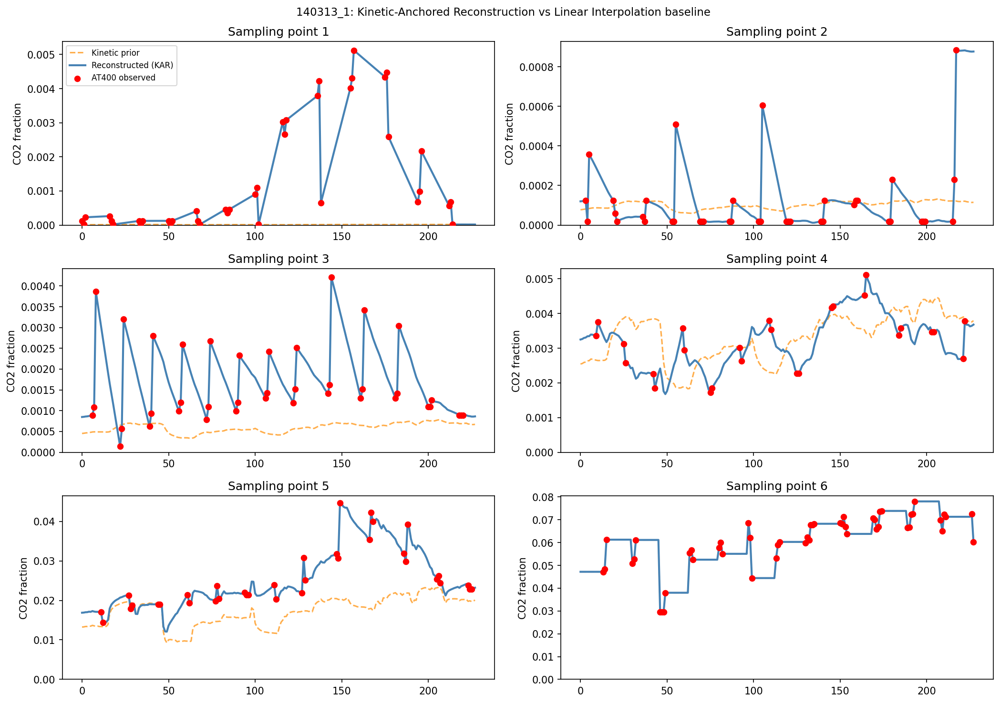

Test run 140207_1:

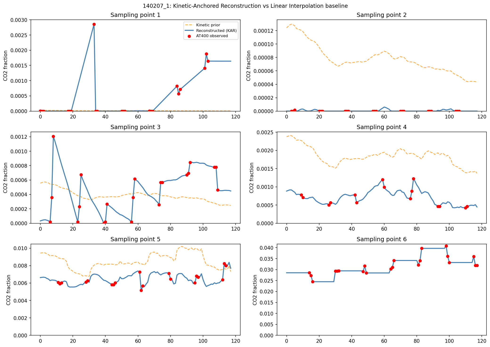

The reconstructed profile (blue) closely follows the physical signal while
sparse red dots confirm alignment with actual measurements.

---

## SDAE: dimensionality reduction

### Why SDAE

The pilot plant has 89 numeric process variables — many correlated (temperatures
at adjacent column stages, flow rates, pressures). Feeding all 95 features into a
sequence model on 8 training runs would overfit severely. SDAE compresses the
input to 16 meaningful latent features while filtering sensor noise.

### Architecture

```
Input (95)  +  AWGN noise (std=0.1, training only)
  -> Linear(95, 64) -> ReLU -> Dropout(0.1)
  -> Linear(64, 32) -> ReLU -> Dropout(0.1)
  -> Linear(32, 16)            [BOTTLENECK: 16 latent features]
  -> Linear(16, 32) -> ReLU
  -> Linear(32, 64) -> ReLU
  -> Linear(64, 95)            [RECONSTRUCTION]
```

Pretrained unsupervised on reconstruction loss, then frozen as a feature extractor.

### Training loss

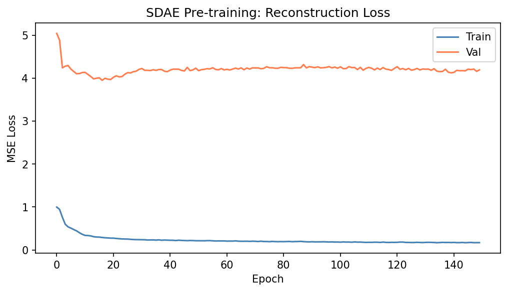

The gap between train and val loss reflects distribution shift between training
runs and the validation run — expected with only 8 pilot-plant sessions.

### Latent space structure

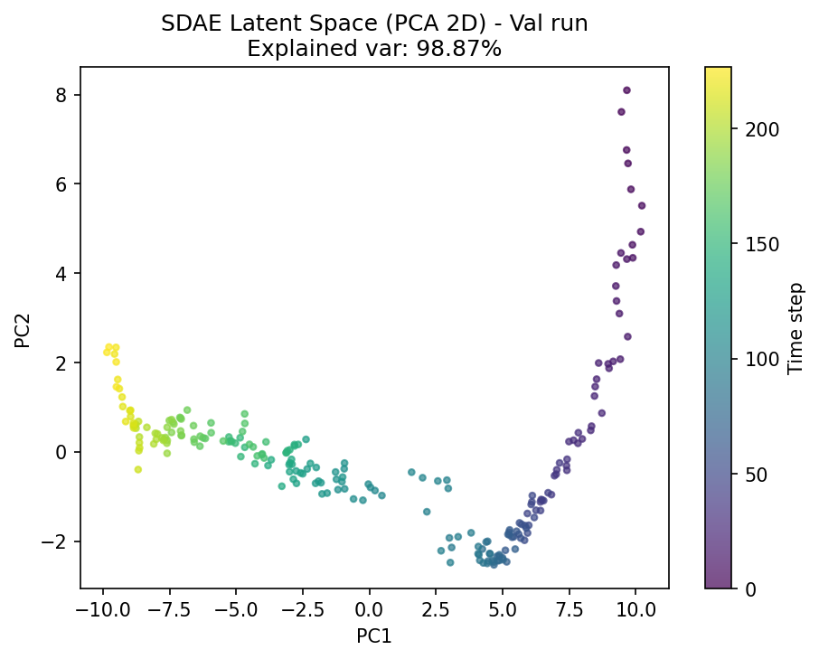

2D PCA of the 16-dimensional latent encoding (colour = time step). Temporal
continuity in latent space confirms the SDAE captures dynamic process evolution.

---

## GRU vs Mini-Transformer

### Training curves

Both models take SDAE-encoded features [batch, 18 timesteps, 16 latent] as input.
Loss = `full_profile_MSE + 1.0 × observed_mask_MSE`.

GRU, h=1:

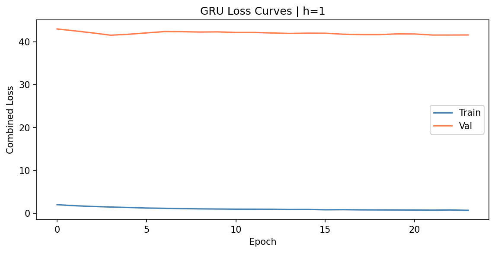

Transformer, h=1:

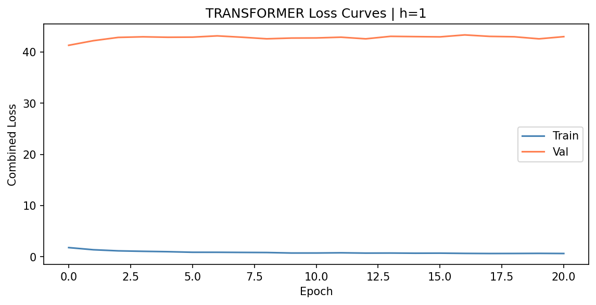

### Predictions on held-out test run (140207\_1)

GRU, h=1:

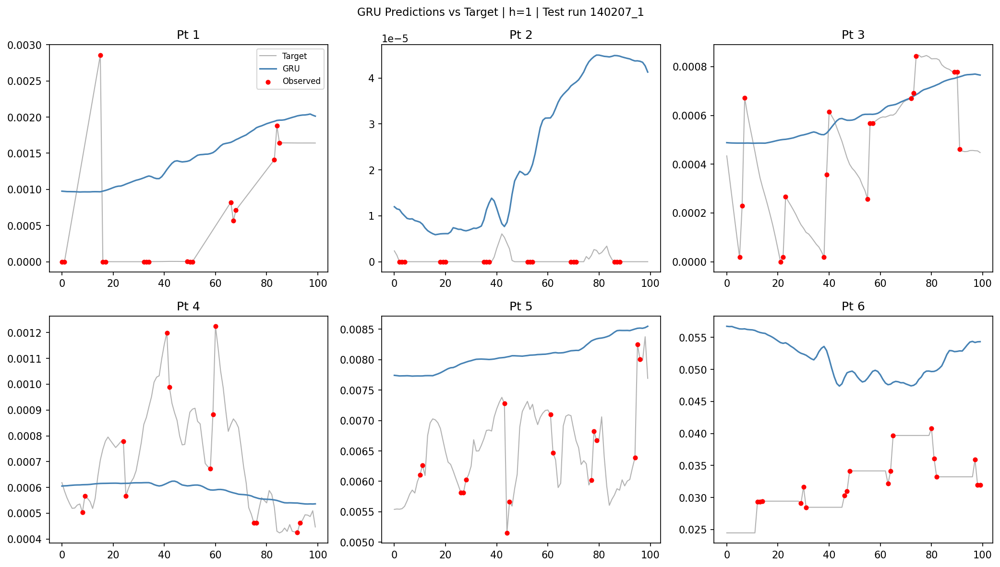

Transformer, h=1:

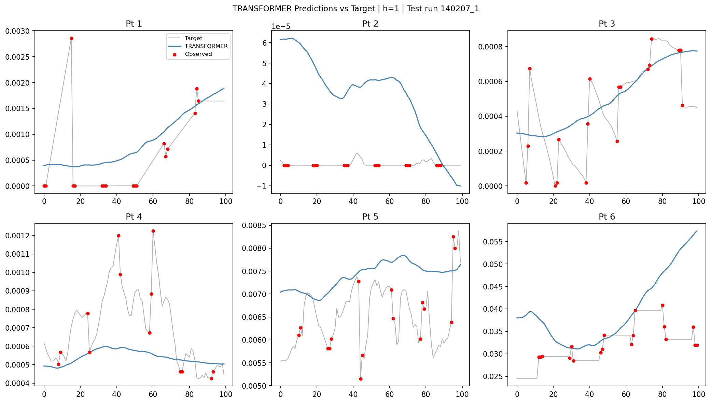

Transformer, h=12:

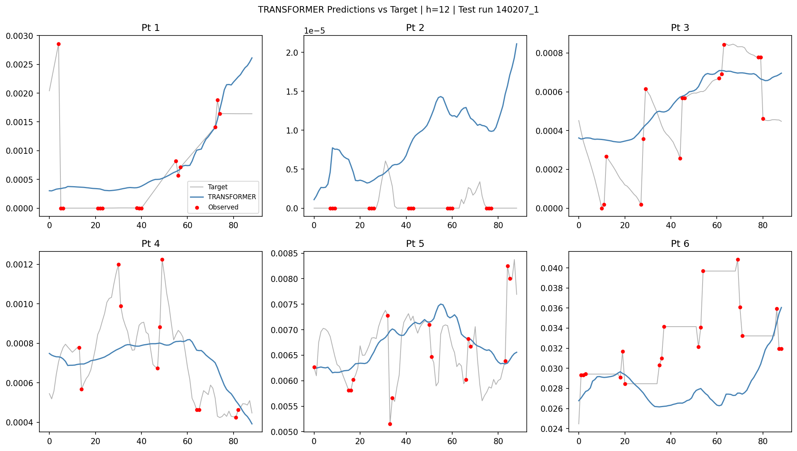

Red dots are actual AT400 measurements. Observed-point RMSE is computed
only at these positions — they are the only ground-truth values in the dataset.

### Prediction scatter (h=1)

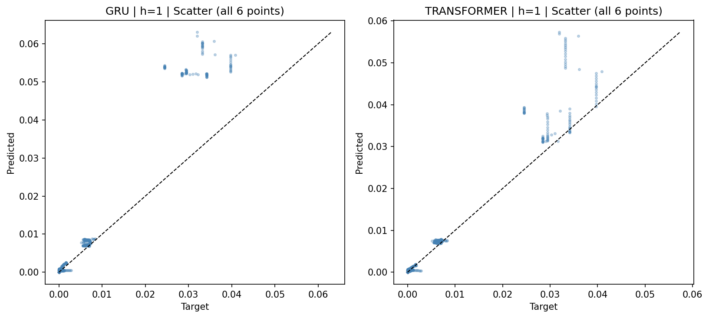

Transformer shows tighter clustering around the diagonal than GRU, particularly
for lower CO2 concentrations at upper column stages.

### Per-point RMSE (h=1)

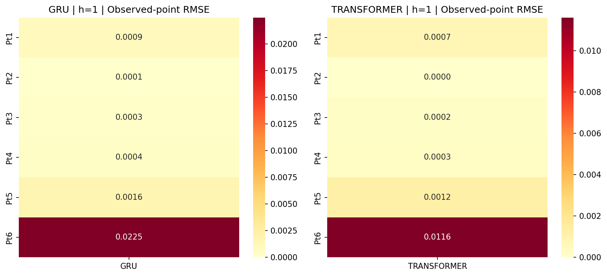

Transformer outperforms GRU at all six sampling points. Both models struggle
most at Point 6 (column inlet — highest CO2, most dynamic range).

### RMSE vs forecast horizon

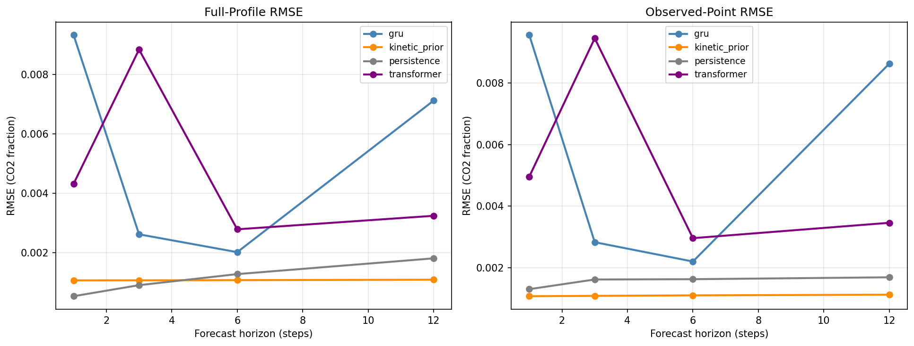

Key observations:

- **Standalone GRU and Transformer underperform the kinetic prior.** The SDAE
  distribution shift on val/test limits latent representation quality — expected
  on a small dataset. However, the models still provide complementary signal
  that fusion exploits to beat the kinetic prior.
- **Transformer is consistently better than GRU** across all horizons.
- **All fused models outperform all standalones**, including the kinetic prior.

---

## Fusion: kinetic prior + data-driven model

### Why fusion works even when standalone models are weak

The kinetic prior is strong on average but has systematic biases in certain
operating regimes. The data-driven model makes different errors at different
times and locations. Combining them with uncertainty-weighted fusion cancels
complementary errors.

### Inverse-variance fusion (point-wise)

Fusion weights estimated from validation-set residuals:

```
var_k[i]  = Var(kinetic[i] - target[i])   on val run
var_m[i]  = Var(model[i]   - target[i])   on val run

fused[i]  = (kinetic[i] / var_k[i]  +  model[i] / var_m[i])
            / (1 / var_k[i]  +  1 / var_m[i])
```

### Kalman + Gaspari-Cohn localization (full 6x6 covariance)

```
x_fused = x_kinetic + B_loc (B_loc + R_loc)^{-1} (x_model - x_kinetic)

B_loc[i,j] = B[i,j] * GC(|i-j| / L)     L = 2
R_loc[i,j] = R[i,j] * GC(|i-j| / L)
```

The Gaspari-Cohn function (fifth-order polynomial, compact support at |i-j| >= 2L)
suppresses spurious long-range correlations between distant sampling points while
preserving positive semidefiniteness — standard in ensemble Kalman filtering.

### Gaspari-Cohn localization matrix

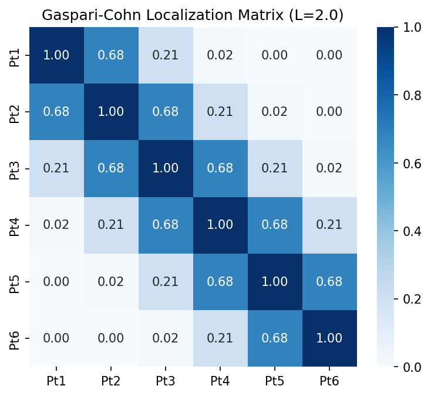

Adjacent sampling points get full correlation weight; points 4+ apart get zero.
This is physically sensible: CO2 at stage 1 and stage 6 of the absorption column
are not meaningfully correlated in residual space.

### Fusion weights

GRU:

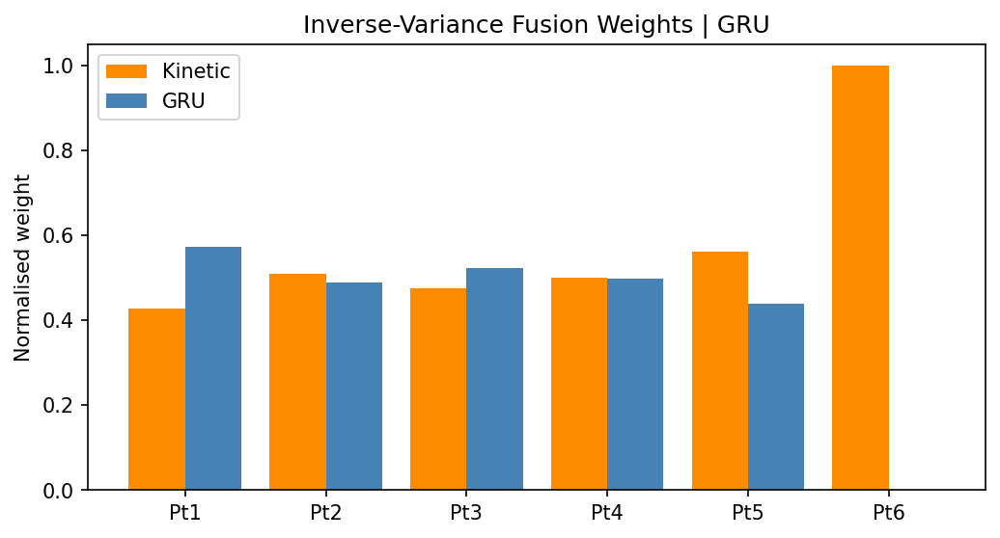

Transformer:

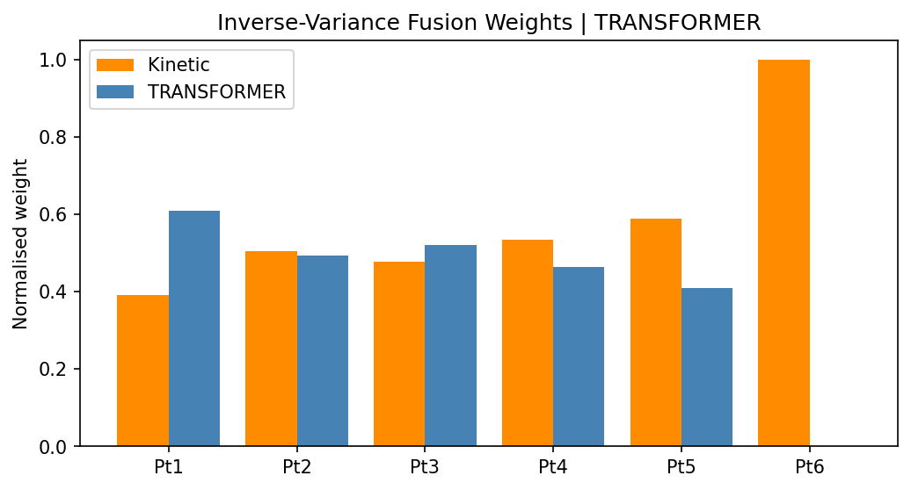

**Point 6 (column inlet):** model weight ≈ 0 — kinetic prior handles the high-CO2
inlet stage well; the data-driven model contributes little there.
**Points 1-5:** weights are roughly balanced (~50/50), both sources contribute.

### Fusion predictions

GRU + Kinetic (Kalman-GC), h=1:

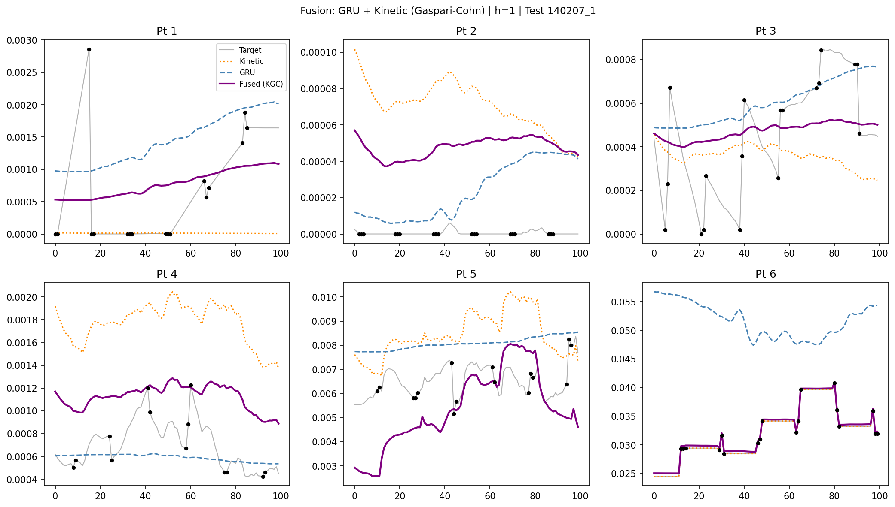

Transformer + Kinetic (Kalman-GC), h=1:

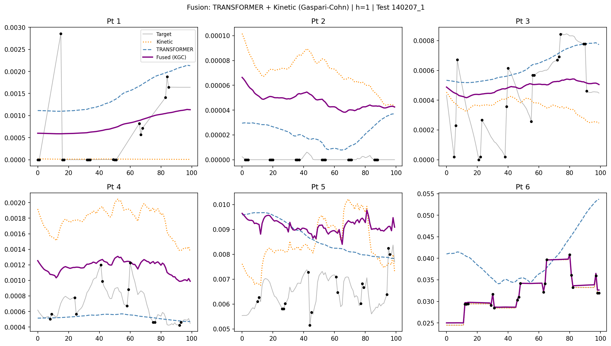

Fused predictions (purple) are visibly closer to the red observed points
than either the kinetic prior (orange dashed) or the standalone model (blue dashed).

---

## Results

All metrics on held-out test run **140207\_1** (never seen during training,
scaler fitting, or fusion weight estimation).

**Primary metric: Observed-Point RMSE** — RMSE only where mask == 1 (real AT400
measurements). Full-profile RMSE includes interpolated pseudo-labels and is secondary.

### Observed-Point RMSE by model and horizon

| Model | h=1 | h=3 | h=6 | h=12 |
|-------|-----|-----|-----|------|
| Persistence baseline | 0.00130 | 0.00161 | 0.00162 | 0.00168 |
| Kinetic prior (Zhuang 2022) | 0.00107 | 0.00108 | 0.00110 | 0.00112 |
| GRU + SDAE | 0.00837 | 0.00224 | 0.01246 | 0.00838 |
| Transformer + SDAE | 0.00465 | 0.00427 | 0.00377 | 0.00272 |
| GRU + Kinetic (Inverse-Variance) | **0.00089** | 0.00080 | 0.00090 | 0.00091 |
| GRU + Kinetic (Kalman-GC) | **0.00089** | 0.00080 | 0.00114 | **0.00073** |
| Transformer + Kinetic (Inverse-Variance) | 0.00097 | 0.00074 | 0.00083 | 0.00077 |
| Transformer + Kinetic (Kalman-GC) | 0.00117 | **0.00068** | 0.00090 | 0.00074 |

### Final model comparison (h=1)

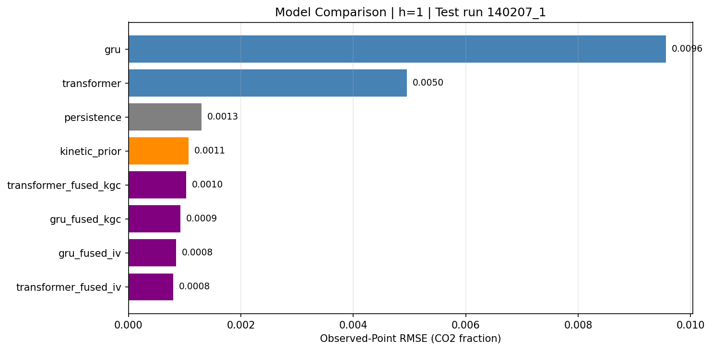

### Key takeaways

- **Best result:** Transformer + Kinetic (Kalman-GC) at h=3: obs-RMSE = **0.00068**,
  a **37% improvement** over kinetic prior alone (0.00108).
- **Fusion always wins** — every fused model beats both standalone components
  across all horizons.
- **Transformer > GRU** in standalone evaluation at all horizons.
- **GRU fusion is competitive** with Transformer fusion despite weaker standalone
  performance — the kinetic prior compensates for GRU's weaknesses.
- **MAPE caution:** inflated at upper stages (Pt 2-5) where CO2 ≈ 0.
  RMSE is the reliable metric for this dataset.

---

## Run split

Whole-run split only. No random row split — overlapping sliding windows on a
random split would leak temporal information across the train/test boundary.

| Split | Run ID | Rows | Purpose |
|-------|--------|------|---------|
| Train | 140120_1, 140206_1, 140207_2, 140214_1, 140214_2, 140227_1 | 552 total | Fit scalers, SDAE, models |
| Val | 140313_1 | 228 | Early stopping + fusion weight estimation |
| Test | 140207_1 | 118 | Final evaluation only |

---

## Project structure

```
co2_project/
  src/
    config.py                  all hyperparameters in one place
    data_loading.py            Excel (multi-index) + kinetic CSV loading
    target_reconstruction.py   KAR: kinetic-anchored residual reconstruction
    autoencoder.py             SDAE with AWGN noise injection
    models.py                  GRUForecaster + MiniTransformerForecaster
    training.py                combined loss, early stopping, AdamW + cosine LR
    metrics.py                 full-profile RMSE, observed-point RMSE, MAPE
    fusion.py                  inverse-variance + Kalman + Gaspari-Cohn
    windowing.py               sliding windows with SDAE encoding
    splitting.py               whole-run train/val/test split
    utils.py                   seed, scaler save/load
  scripts/
    run_pipeline.py            single script: all phases end to end
  notebooks/
    01_data_understanding.ipynb
    02_sdae_dimensionality_reduction.ipynb
    03_gru_transformer_training.ipynb
    04_evaluation_and_fusion.ipynb
  tests/
    test_all.py                17 tests (alignment, reconstruction, windowing, fusion)
  outputs/
    figures/                   29 plots (auto-generated)
    metrics/                   CSV results tables, training histories
    checkpoints/               model weights (.pt files)
  requirements.txt
  run_all.sh
```

---

## Quick start

```bash
git clone https://github.com/Miouin/co2_project.git
cd co2_project
pip install -r requirements.txt

# Run full pipeline
python scripts/run_pipeline.py

# Run tests
pytest tests/ -v

# Open notebooks
jupyter notebook notebooks/
```

`data/raw_with_label/` and `data/kinetic_prior/` must be present.
Kinetic CSVs are from the
[original repository](https://github.com/tonyzyl/CO2-Soft-sensor-for-a-carbon-capture-pilot-plant).

---

## Limitations

- Full six-point CO2 profile is a **pseudo-label** (reconstructed, not directly
  observed). Observed-point RMSE is the only ground-truth metric.
- Kinetic prior is from precomputed MATLAB/Simulink outputs — not regenerated here.
- Small dataset (8 runs, 50-228 rows each). SDAE shows distribution shift on
  val/test. Results reflect performance on a single held-out run.
- MHE-based reconstruction (Chai et al. 2026) would provide physically consistent
  labels without interpolation, but requires an online ODE solver (IPOPT/CasADi).

---

## References

Zhuang, Y., Liu, Y., Ahmed, A., et al. (2022). A hybrid data-driven and mechanistic
model soft sensor for estimating CO2 concentrations for a carbon capture pilot plant.
*Computers & Industrial Engineering*, 143, 103747.
https://doi.org/10.1016/j.cie.2022.103747

Chai, S., Guo, S., Mercangöz, M. (2026). Hybrid Data-Driven and Mechanistic CO2
Soft Sensor with MHE-Imputed Labels and Covariance-Weighted Fusion.
*Processes*, 14, 916. https://doi.org/10.3390/pr14060916
